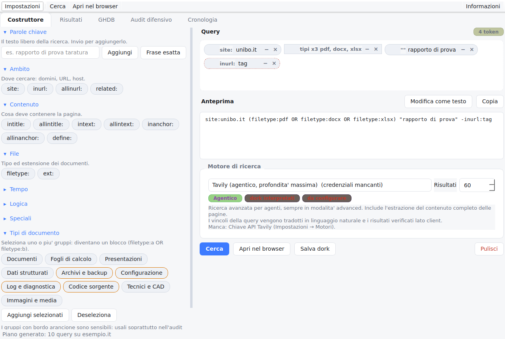
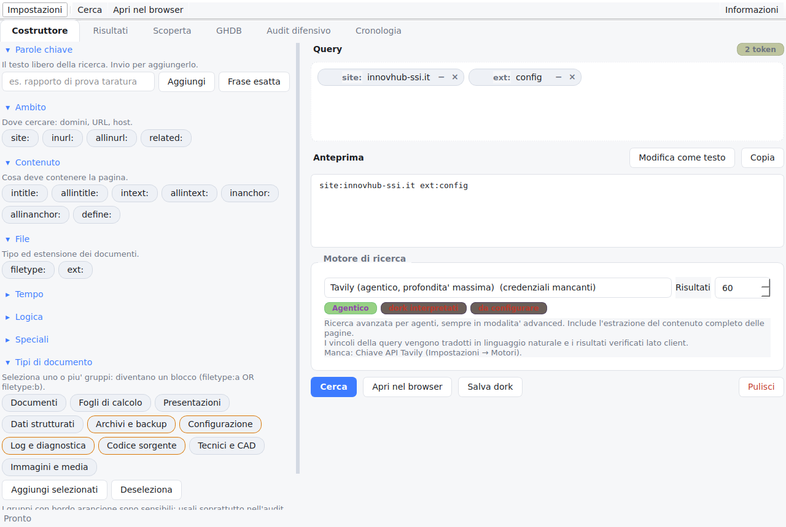
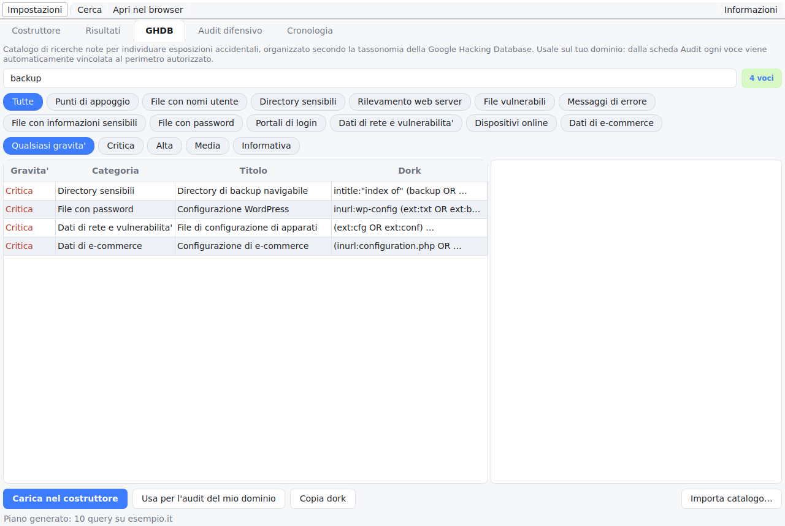
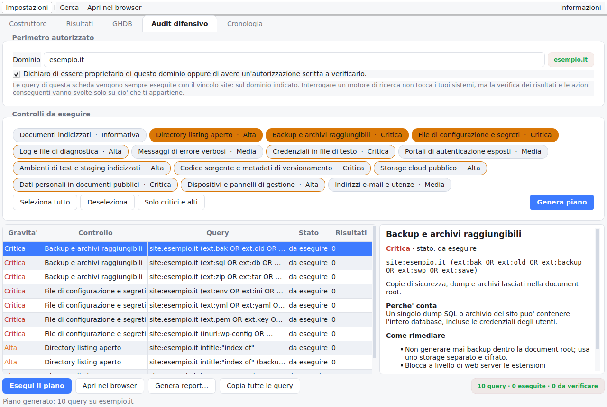

# DorkLab

Applicazione desktop per **Linux/Fedora** che rende visuale e interattivo il
*Google dorking*: costruisci ricerche avanzate a bolle, estrai documentazione in
profondità da più motori (anche agentici) e verifica l'esposizione del tuo
dominio con un catalogo in stile GHDB.



---

## Indice

- [Cosa fa](#cosa-fa)
- [Installazione su Fedora](#installazione-su-fedora)
- [Primo avvio](#primo-avvio)
- [Motori di ricerca](#motori-di-ricerca)
- [Le quattro schede](#le-quattro-schede)
- [Configurazione](#configurazione)
- [Architettura](#architettura)
- [Sviluppo](#sviluppo)
- [Uso lecito](#uso-lecito)

---

## Cosa fa

**Costruzione visuale delle query.** Ogni operatore è una bolla cliccabile.
Cliccandola compare una *chip* modificabile: valore in linea, `−` per negare,
`&`/`OR` per il legame logico, menu contestuale per virgolette e riordino.
L'anteprima mostra sempre la query reale, e si può passare alla modifica
testuale e tornare indietro senza perdere nulla: il parser ricostruisce le
bolle da qualsiasi dork incollato.

**Estrazione documentale in profondità.** Dieci gruppi di tipi di file
(documenti, fogli, presentazioni, dati, archivi, configurazioni, log, codice,
tecnici, media) diventano con un clic un blocco `(filetype:a OR filetype:b …)`.
I risultati si scaricano con controlli di sicurezza (rispetto di `robots.txt`,
ritardo fra richieste, tetto di dimensione) e ne vengono estratti i **metadati**
— autore, software, organizzazione, date — aggregati per individuare ricorrenze.

**Scoperta di contenuto non indicizzato.** E' il vero senso di queste ricerche:
i motori indicizzano solo una frazione del web pubblico. La scheda **Scoperta**
pesca il resto, dal dominio che indichi, attraverso sei fonti:

- **Wayback Machine** — tutti gli URL mai archiviati, con la data dello snapshot
  e la copia recuperabile *anche se la pagina non e' piu' online*;
- **Common Crawl** — il piu' grande corpus web pubblico, spesso con URL assenti
  dagli indici commerciali;
- **Certificate Transparency (crt.sh)** — sottodomini ricavati dai log dei
  certificati TLS: staging, portali interni, servizi dimenticati;
- **Sitemap e robots.txt** — le mappe che il sito pubblica per i crawler; i
  percorsi in `Disallow` sono spesso i piu' interessanti;
- **Directory aperte** — un crawler che cammina negli indici lasciati navigabili
  dal server, raccogliendo file non collegati da alcuna pagina;
- **Sondaggio percorsi** — prova un elenco curato di percorsi (backup,
  configurazioni, cartelle di documenti) contro il server: e' ricognizione
  attiva e richiede la conferma di autorizzazione, come l'audit. Riconosce i
  siti *soft-404* (che rispondono 200 a qualsiasi URL) e ne esclude i falsi
  positivi, così non ti segnala file che in realtà non esistono.

Gli URL scoperti passano dalla stessa pipeline dei risultati di ricerca:
download, estrazione dei metadati, export. E c'e' l'opzione **"Scarica dalla
copia archiviata"**, che recupera il documento dallo snapshot dell'archivio
quando il vivo non risponde piu'.

**Protective dorking.** Quattordici famiglie di controlli difensivi, ciascuna
con spiegazione del rischio e passi di rimedio concreti, applicate **sempre e
solo** al dominio che dichiari di essere autorizzato a verificare. Il risultato
è un report in Markdown, HTML o CSV.

**Catalogo GHDB.** 54 voci curate organizzate secondo la tassonomia della Google
Hacking Database, ognuna con gravità e rimedio. Il catalogo è estendibile
importando file JSON o CSV.

---

## Installazione su Fedora

### Script automatico (consigliato)

```bash
git clone https://github.com/Albe750/DorkLab.git
cd DorkLab
./install-fedora.sh
```

Lo script installa le dipendenze dai repository Fedora, offre le estensioni
opzionali, installa il pacchetto e crea la voce nel menu applicazioni.

### Manuale

```bash
sudo dnf install python3-pyqt6 python3-requests
pip install --user .

# opzionali
pip install --user anthropic   # FACOLTATIVO: il motore Claude funziona anche senza
pip install --user pypdf       # metadati PDF più completi
```

### Senza installare

```bash
./run.sh
```

DorkLab funziona indifferentemente con **PyQt6** o **PySide6**: usa quello che
trova, quindi va bene sia `python3-pyqt6` sia `python3-pyside6`.

---

## Primo avvio

1. Al primo lancio compare una nota sull'uso consapevole: va accettata.
2. **Impostazioni → Motori e credenziali**: inserisci la chiave del motore che
   vuoi usare. Senza alcuna chiave l'applicazione funziona comunque: i motori
   *browser* non ne richiedono.
3. Componi la prima query nella scheda **Costruttore** e premi `Ctrl+Invio`.

---

## Motori di ricerca

DorkLab distingue tre famiglie, con comportamenti diversi rispetto agli
operatori dork.

| Motore | Tipo | Operatori dork | Credenziale |
|---|---|---|---|
| Google, Startpage | browser | nativi | — |
| Bing, DuckDuckGo, Brave, Yandex, Mojeek, SearXNG | browser | parziali | — |
| Google Programmable Search | API | nativi | chiave + `cx` |
| SerpApi | API | nativi | chiave |
| Brave Search API | API | parziali | chiave |
| SearXNG (istanza propria) | API | parziali | solo URL |
| **Tavily** | agentico | interpretati | chiave |
| Claude | agentico | interpretati | chiave Anthropic (pacchetto `anthropic` facoltativo) |
| Perplexity | agentico | interpretati | chiave |
| Exa | agentico | interpretati | chiave |

### Tavily, sempre alla massima profondità

Tavily è il motore predefinito e viene interrogato **esclusivamente in modalità
avanzata**, senza alternative ridotte:

- `search_depth: "advanced"` — il livello più approfondito dell'API;
- `chunks_per_source: 3` — il massimo di frammenti per fonte, accettato solo in
  modalità avanzata;
- `include_answer: "advanced"` — sintesi estesa;
- `include_raw_content: true` — testo completo delle pagine.

Poiché una singola chiamata restituisce al massimo 20 risultati, quando ne
chiedi di più DorkLab **scompone la query in varianti** — una per estensione o
una per dominio — e unisce i risultati deduplicati. Così
`site:unibo.it (filetype:pdf OR filetype:docx OR filetype:xlsx)` con 60
risultati richiesti diventa quattro ricerche distinte, ciascuna con il proprio
budget, invece di una sola che si ferma a venti.

L'endpoint `/extract` di Tavily alimenta il pulsante **Estrazione approfondita**
nella scheda Risultati: recupera il testo completo delle pagine selezionate
(`extract_depth: "advanced"`), anche quando il contenuto è costruito lato client.

### Motori agentici e vincoli

I motori agentici interpretano la richiesta invece di eseguire `site:` o
`filetype:` alla lettera. DorkLab compensa su tre livelli:

1. **traduce** i vincoli della query in istruzioni in linguaggio naturale;
2. **li passa in forma strutturata** dove l'API lo consente — `include_domains`
   per Tavily ed Exa, `allowed_domains` per la ricerca web di Claude;
3. **verifica i risultati lato client** e marca ogni riga come `ok`, `parziale`
   o `fuori` perimetro, con la casella «Solo conformi» per nascondere il resto.

È la parte che rende utilizzabile un motore agentico per un audit: la comodità
della ricerca sintetica senza perdere il controllo del perimetro.

Il motore **Claude non richiede il pacchetto `anthropic`**: se è installato lo
usa, altrimenti chiama l'API via HTTP diretto con `requests` (già dipendenza).
Così funziona in qualsiasi ambiente, anche in un venv dove non riesci a
installare l'SDK: basta la chiave (`ANTHROPIC_API_KEY` o Impostazioni → Motori).

---

## Le schede

### Costruttore


Tavolozza a sinistra (operatori per categoria, tipi di documento, 22 ricette
pronte), tela della query a destra. Le ricette coprono i casi ricorrenti:
documenti di un dominio, report e whitepaper, dataset aperti, pubblicazioni
accademiche, tesi, norme e standard, manuali, slide, documenti della PA, bandi,
bilanci, directory aperte, brevetti, mappatura dei sottodomini.

### Risultati

Tabella ordinabile con tipo, dominio ed esito della verifica dei vincoli.
Da qui si aprono, si copiano, si **scaricano** i documenti e se ne estraggono i
**metadati aggregati**. Al download scegli la cartella di destinazione con un
selettore (la scelta viene ricordata) e a fine scaricamento puoi aprirla
direttamente. Esportazione in CSV, JSON, Markdown e HTML.

### Scoperta



Le sei fonti di contenuto non indicizzato descritte sopra. Fonti raggruppate
per classe (archivio di terze parti, mappe del sito, sondaggio attivo), filtro
opzionale per tipo di documento, e il recupero dalla copia archiviata. Il
sondaggio dei percorsi resta disabilitato finche' non dichiari l'autorizzazione
sul dominio.

### GHDB



Catalogo consultabile per categoria, gravità e testo libero. Ogni voce si carica
nel costruttore o si invia all'audit, dove riceve automaticamente il vincolo di
perimetro.

### Audit difensivo



Inserisci il dominio, **dichiari di esserne proprietario o di avere
un'autorizzazione scritta**, scegli i controlli e generi il piano. Senza quella
conferma il pulsante resta disabilitato e `build_plan()` solleva
`AuthorizationError`: non è un avviso cosmetico, è un vincolo del modulo,
verificato dai test.

Ogni query passa da `enforce_scope()`, che garantisce due cose su **tutte** le
query prodotte: contengono un vincolo `site:` e menzionano il dominio
autorizzato. Il caso non banale sono i controlli sullo storage cloud, del tipo
`site:s3.amazonaws.com esempio.it`: il loro `site:` punta al provider, non al
tuo dominio, perché servono a cercare *lì* le menzioni del tuo dominio — che
viene quindi aggiunto come termine obbligatorio.

I controlli coprono documenti indicizzati,
directory listing, backup, file di configurazione, log, errori verbosi,
credenziali in chiaro, portali di login, ambienti di staging, repository
esposti, storage cloud, dati personali, apparati di gestione e indirizzi e-mail.

---

## Configurazione

| Percorso | Contenuto |
|---|---|
| `~/.config/dorklab/config.json` | impostazioni e chiavi (permessi `600`) |
| `~/.local/share/dorklab/dorklab.db` | cronologia e dork salvati |
| `~/.local/share/dorklab/ghdb_user.json` | voci GHDB importate |
| `~/.local/share/dorklab/downloads/` | documenti scaricati |

Le chiavi possono stare nell'ambiente invece che su disco — in quel caso hanno
la precedenza e non vengono mai scritte:

```bash
export TAVILY_API_KEY="…"
export ANTHROPIC_API_KEY="…"
export DORKLAB_GOOGLE_API_KEY="…"
export DORKLAB_GOOGLE_CX="…"
export BRAVE_SEARCH_API_KEY="…"
export SERPAPI_API_KEY="…"
export PERPLEXITY_API_KEY="…"
export EXA_API_KEY="…"
```

---

## Architettura

```
dorklab/
├── query.py          modello dei token, composizione e parsing round-trip
├── constraints.py    estrazione dei vincoli, verifica, traduzione in linguaggio naturale
├── catalog.py        accesso al catalogo statico
├── audit.py          piani di audit, perimetro e autorizzazione
├── ghdb.py           catalogo GHDB e importazione
├── metadata.py       metadati PDF/OOXML/ODF
├── fetcher.py        download con robots.txt, ritardo e limiti
├── exporters.py      CSV, JSON, Markdown, HTML e report di audit
├── store.py          cronologia su SQLite
├── providers/        registro dei motori (browser, API, agentici)
├── data/             catalogo JSON: operatori, tipi, ricette, audit, GHDB
└── ui/               interfaccia Qt (bolle, schede, worker in thread separati)
```

Le operazioni di rete girano in `QThread` dedicati: l'interfaccia non si blocca
mai, e ogni operazione lunga è interrompibile.

Il livello dei motori è a innesto: aggiungerne uno significa scrivere una classe
con `id`, `label`, `kind`, `credentials` e un metodo `search()` che restituisce
un `SearchResponse`, e registrarla in `providers/__init__.py`.

---

## Sviluppo

```bash
pip install --user -e ".[dev]"
python3 -m pytest tests -q      # 60 test
```

I test coprono il round-trip del parser, la verifica dei vincoli, la logica di
profondità di Tavily, l'integrità del catalogo e — soprattutto — le garanzie
del modulo di audit: nessuna query può uscire dal perimetro autorizzato e
nessun piano si genera senza conferma esplicita.

---

## Uso lecito

DorkLab compone interrogazioni per i motori di ricerca. **Non attacca sistemi,
non sfrutta vulnerabilità, non accede a nulla che non sia già pubblicamente
indicizzato.**

- La ricerca documentale e l'OSINT su fonti pubbliche sono attività lecite.
- L'audit difensivo è pensato per il **tuo** perimetro: richiede di dichiarare
  il dominio e la titolarità o l'autorizzazione scritta a verificarlo.
- Trovare un documento non autorizza a usarne il contenuto: restano validi
  diritto d'autore, segreto industriale e normativa sui dati personali.
- Se emergono dati personali altrui, la strada corretta è la **segnalazione
  responsabile** al titolare, non la raccolta.
- Lo scraping delle pagine dei risultati viola i termini di servizio dei motori:
  per questo DorkLab usa solo API ufficiali o apre il browser dell'utente.

Chi usa lo strumento è responsabile del rispetto delle leggi applicabili e delle
autorizzazioni di cui dispone.

---

## Licenza

MIT — vedi [LICENSE](LICENSE).
